# Docker Lab Practical Report
**Platform:** KodeKloud  
**Topic:** Docker Basics  
**Total Questions:** 17  

---

## Question 1 – What Version of the Docker Server Engine Is Being Used on the Host?

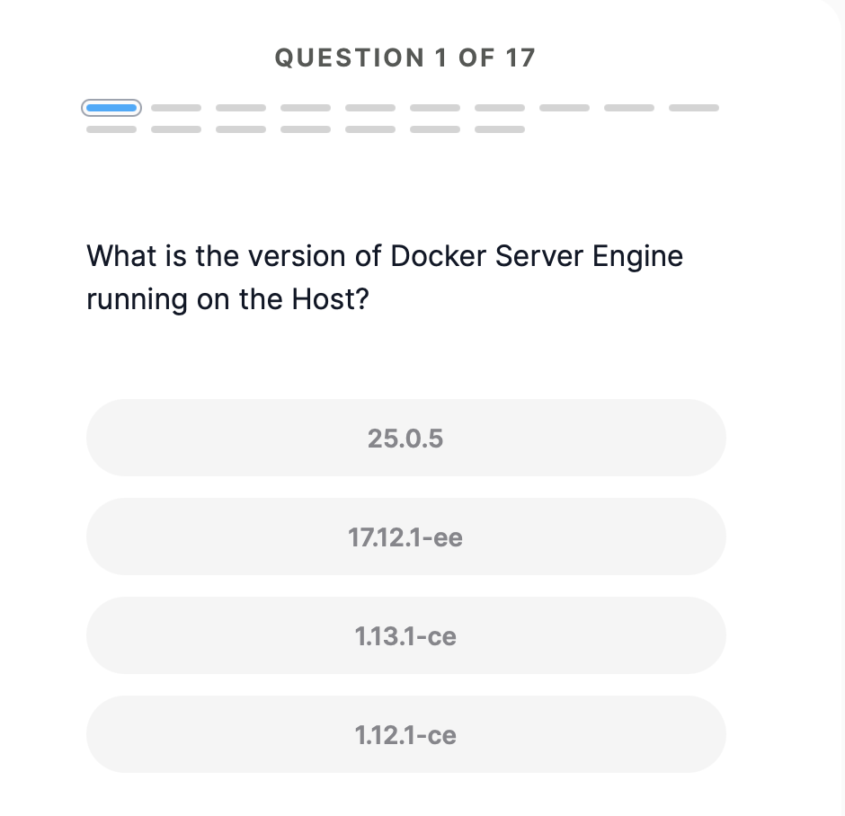
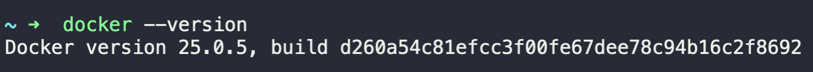

**Used Command:** 
```bash
docker --version
```

**Output:** 
```
Docker version 25.0.5, build d260a54c81efcc3f00fe67dee78c94b16c2f8692
```

---

## Question 2 – How many containers are running on this host?

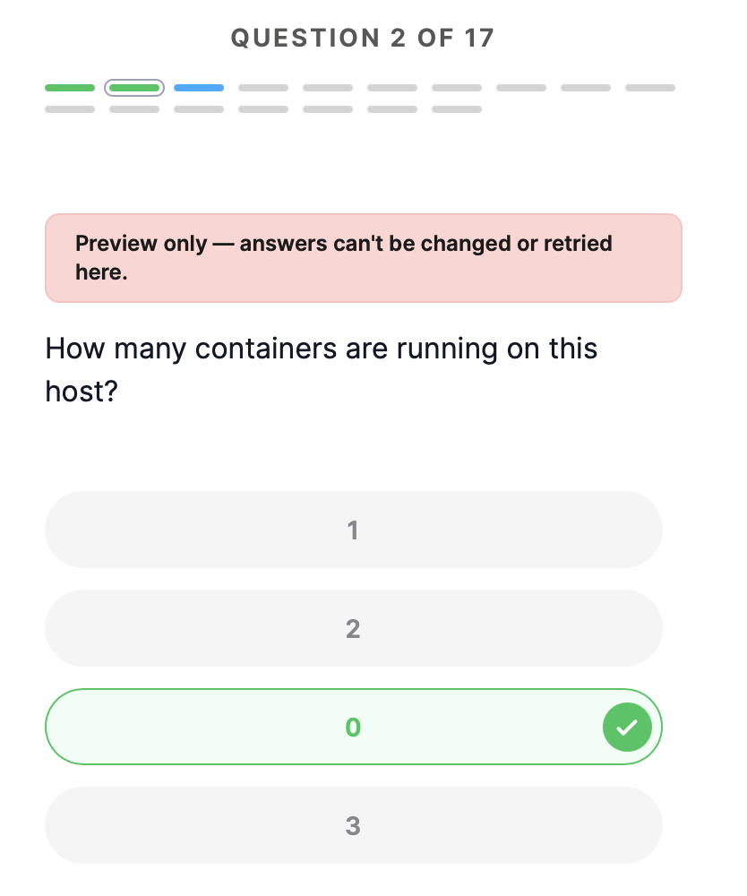
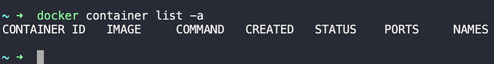

**Command Executed:**  
```bash
docker container list -a
```

**Result:**  
An empty result set indicating no containers are available.

**Answer:** `0`

**Explanation:**  
`docker container list -a` command is used to display all the containers, whether they are up and running or not. An empty output confirms there were **0 containers** running.

---

## Question 3 — How many images are available on this host?

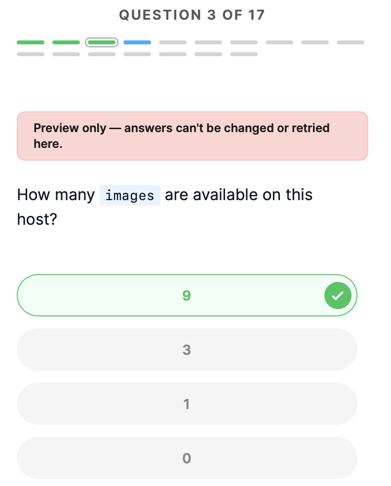
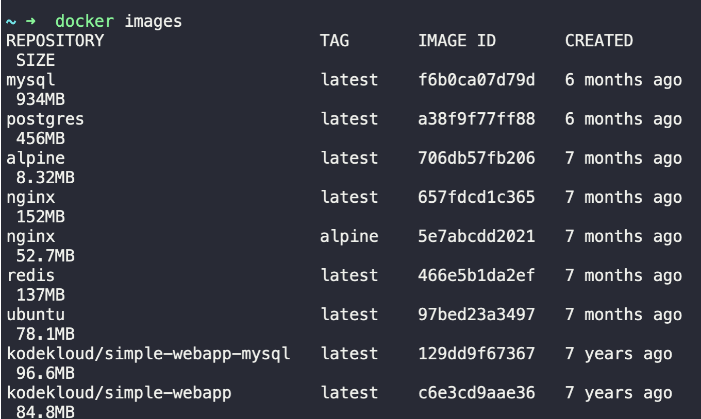

**Command Used:**
```bash
docker images
```

**Output:**

| Repository | Tag | Image ID | Created |
|---|---|---|---|
| mysql | latest | f6b0ca07d79d | 6 months ago |
| postgres | latest | a38f9f77ff88 | 6 months ago |
| alpine | latest | 706db57fb206 | 7 months ago |
| nginx | latest | 657fdcd1c365 | 7 months ago |
| nginx | alpine | 5e7abcdd2021 | 7 months ago |
| redis | latest | 466e5b1da2ef | 7 months ago |
| ubuntu | latest | 97bed23a3497 | 7 months ago |
| kodekloud/simple-webapp-mysql | latest | 129dd9f67367 | 7 years ago |
| kodekloud/simple-webapp | latest | c6e3cd9aae36 | 7 years ago |

**Answer:** `9`

**Explanation:**  
`docker images` lists all locally available images. Counting all rows gives **9 images**.

---

## Question 4 — Run a container using the `redis` image (Detached Mode)

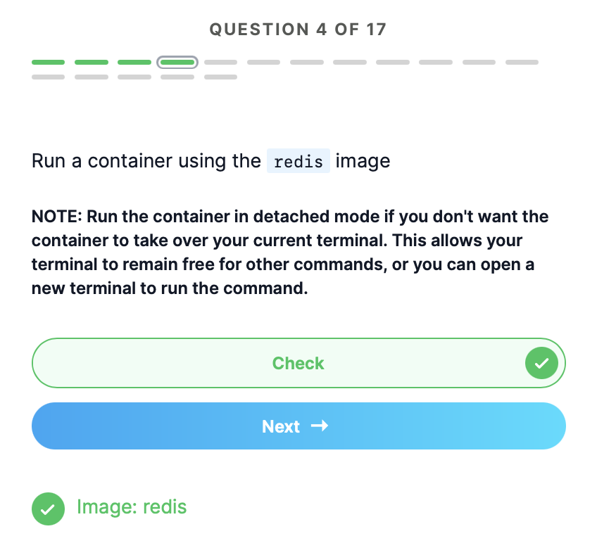
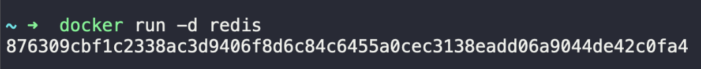

**Command Used:**
```bash
docker run -d redis
```

**Output:**
```
876309cbf1c2338ac3d9406f8d6c84c6455a0cec3138eadd06a9044de42c0fa4
```

**Result:** ✅ Container created successfully — Image: redis

**Explanation:**  
The `-d` flag runs the container in **detached mode**, meaning it runs in the background and frees the terminal. Docker returns the full container ID upon success.

---

## Question 5 — Stop the container you just created

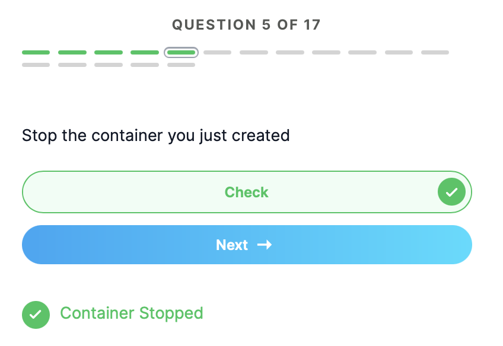
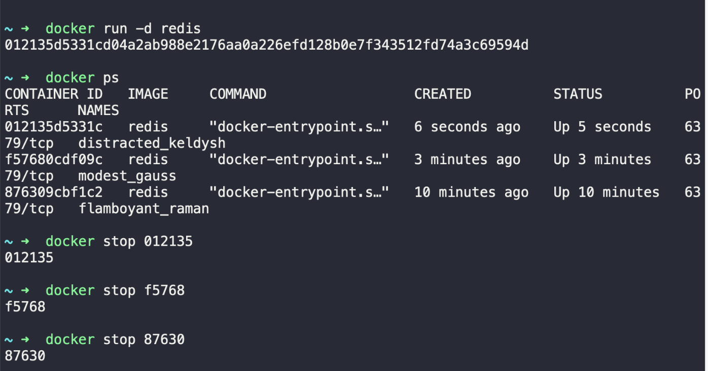

**Command Used:**
```bash
docker stop 927744
```

**Output:**
```
927744
```

**Result:** ✅ Container Stopped

**Explanation:**  
`docker stop` sends a SIGTERM signal to gracefully stop the container. Docker accepts a short prefix of the container ID — no need to type the full ID.

---

## Question 6 — How many containers are RUNNING on this host now?

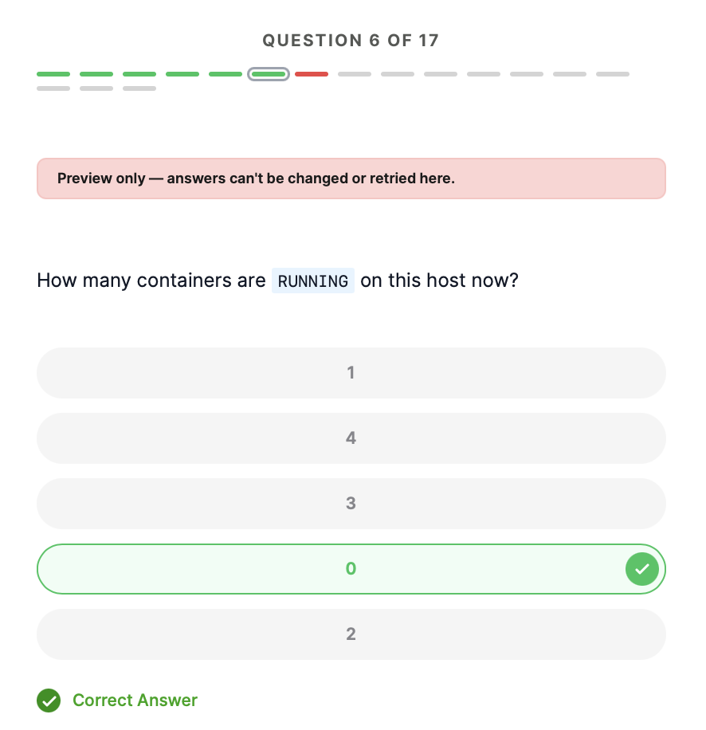
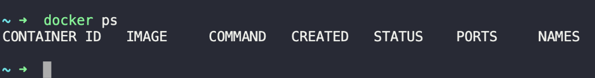

**Command Used:**
```bash
docker ps
```

**Output:** Empty — no running containers.

**Answer:** `0`

**Explanation:**  
After stopping the redis container, `docker ps` showed no running containers. All previously created containers had been stopped.

---

## Question 7 — How many containers are RUNNING on this host now? (after creating a few)

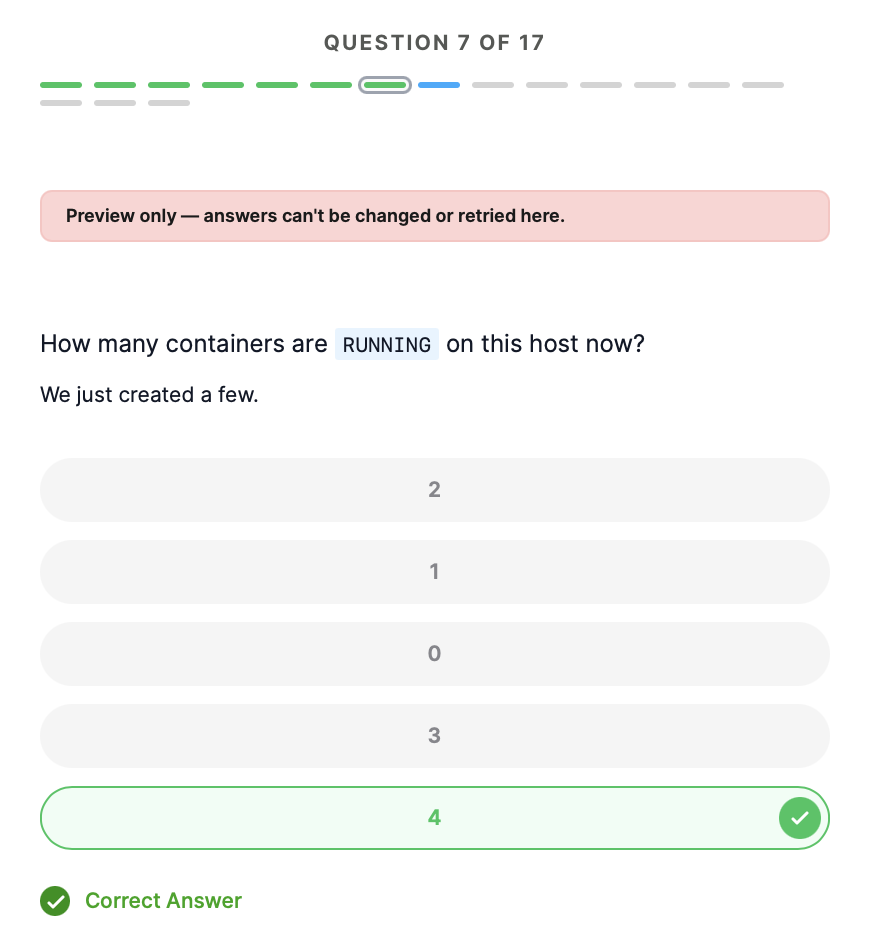
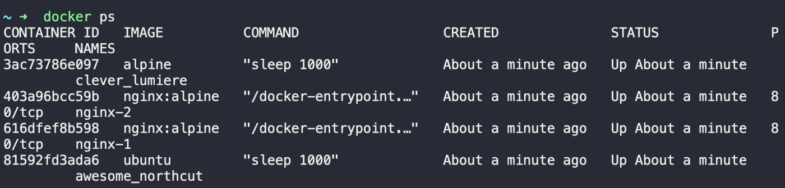

**Command Used:**
```bash
docker ps
```

**Output:**

| Container ID | Image | Name |
|---|---|---|
| 3ac73786e097 | alpine | clever_lumiere |
| 403a96bcc59b | nginx:alpine | nginx-2 |
| 616dfef8b598 | nginx:alpine | nginx-1 |
| 81592fd3ada6 | ubuntu | awesome_northcut |

**Answer:** `4`

**Explanation:**  
The lab automatically created several containers. `docker ps` listed **4 running containers** — two nginx:alpine, one alpine, and one ubuntu.

---

## Question 8 — How many containers are PRESENT on the host now? (Including both Running and Not Running)

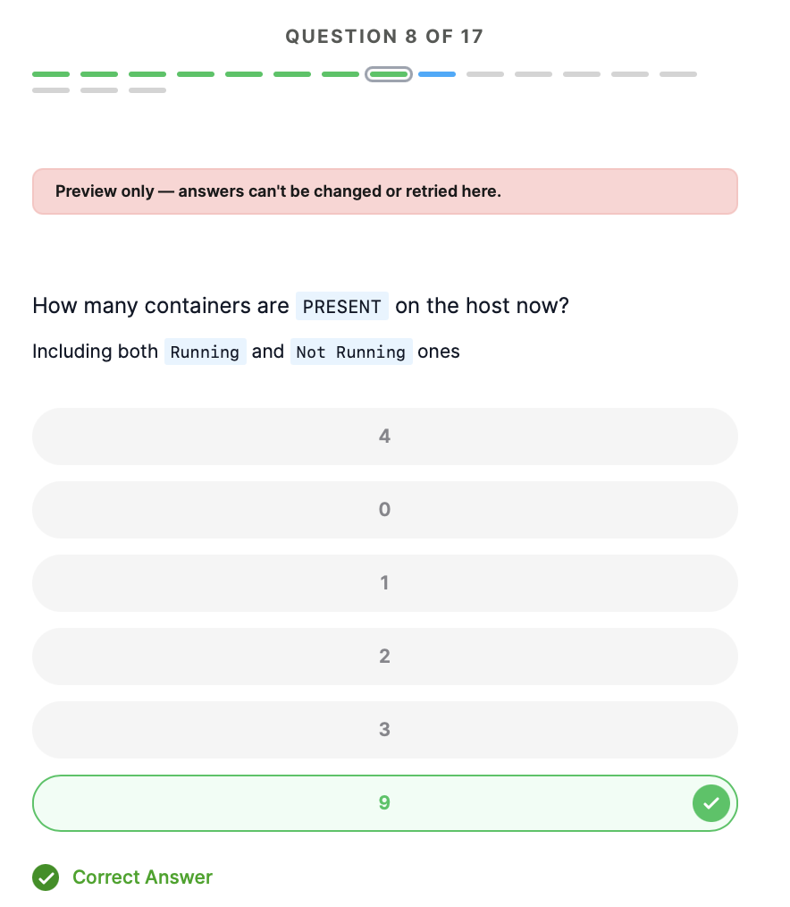
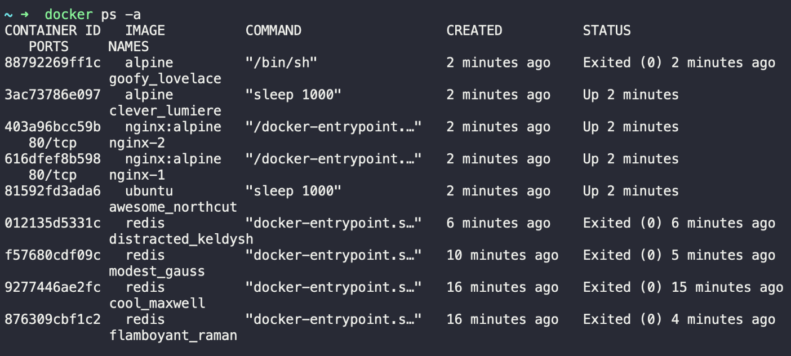

**Command Used:**
```bash
docker ps -a
```

**Output:** 9 containers total (4 running + 5 exited/stopped)

| Container ID | Image | Status |
|---|---|---|
| 88792269ff1c | alpine | Exited (0) |
| 3ac73786e097 | alpine | Up 2 minutes |
| 403a96bcc59b | nginx:alpine | Up 2 minutes |
| 616dfef8b598 | nginx:alpine | Up 2 minutes |
| 81592fd3ada6 | ubuntu | Up 2 minutes |
| 012135d5331c | redis | Exited (0) |
| f57680cdf09c | redis | Exited (0) |
| 9277446ae2fc | redis | Exited (0) |
| 876309cbf1c2 | redis | Exited (0) |

**Answer:** `9`

**Explanation:**  
The `-a` flag shows **all** containers regardless of state. There were 9 total — 4 running and 5 stopped/exited.

---

## Question 9 — What is the image used to run the `nginx-1` container?

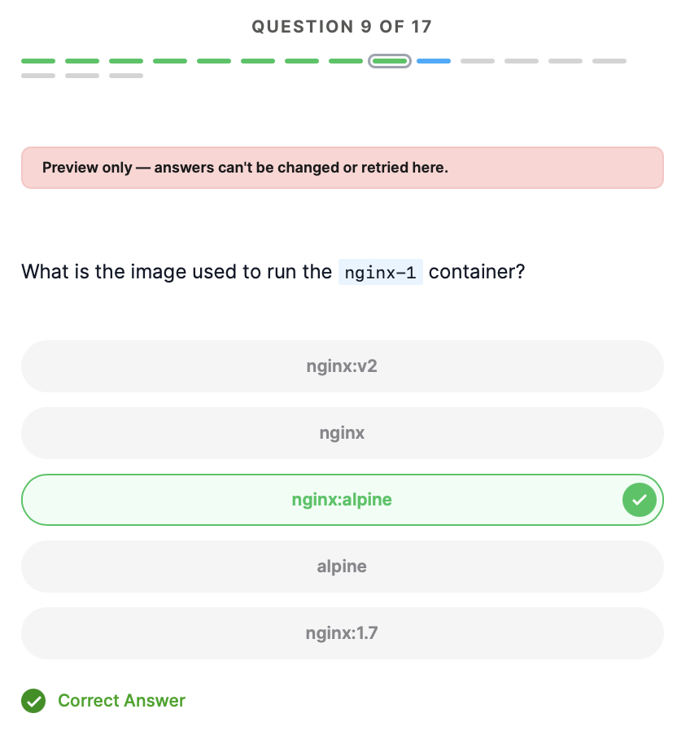
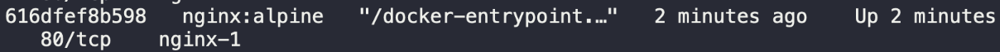

**Command Used:**
```bash
docker ps
```

**Relevant Output:**
```
616dfef8b598   nginx:alpine   "/docker-entrypoint..."   2 minutes ago   Up 2 minutes   80/tcp   nginx-1
```

**Answer:** `nginx:alpine`

**Explanation:**  
By inspecting the IMAGE column of `docker ps` for the container named `nginx-1`, the image used was **nginx:alpine**.

---

## Question 10 — What is the name of the container created using the `ubuntu` image?

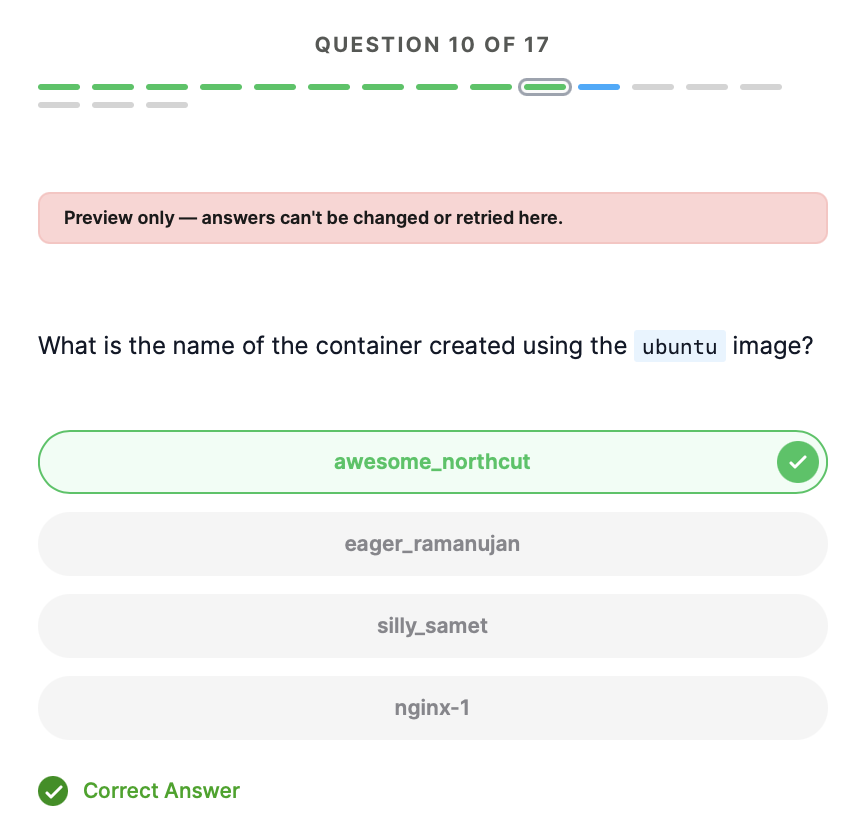
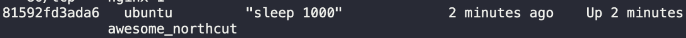

**Command Used:**
```bash
docker ps -a
```

**Relevant Output:**
```
81592fd3ada6   ubuntu   "sleep 1000"   2 minutes ago   Up 2 minutes   awesome_northcut
```

**Answer:** `awesome_northcut`

**Explanation:**  
Filtering the `docker ps -a` output for the ubuntu image revealed the container name was **awesome_northcut** — Docker auto-generates these fun random names when no name is specified.

---

## Question 11 — What is the ID of the container that uses the `alpine` image and is NOT running?

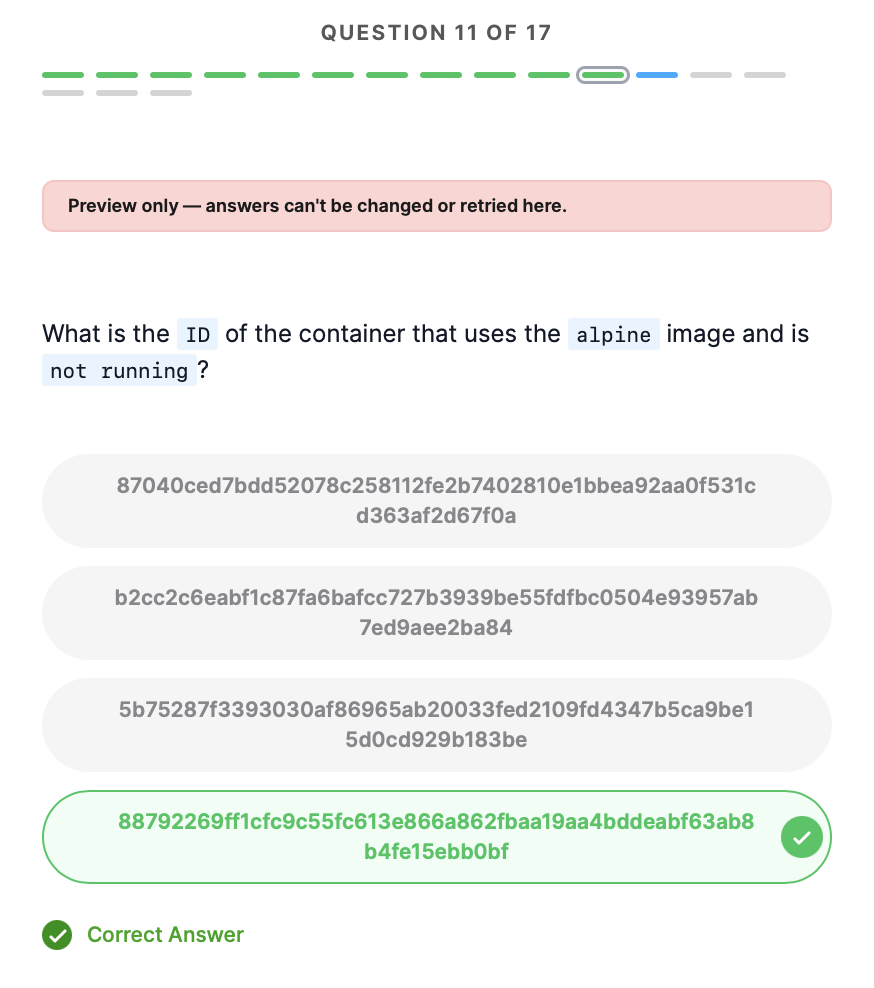
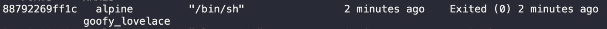

**Command Used:**
```bash
docker ps -a
```

**Relevant Output:**
```
88792269ff1c   alpine   "/bin/sh"   2 minutes ago   Exited (0) 2 minutes ago   goofy_lovelace
```

**Answer:** `88792269ff1cfc9c55fc613e866a862fbaa19aa4bddeabf63ab8b4fe15ebb0bf`

**Explanation:**  
There were two alpine containers — one running (`clever_lumiere`) and one stopped (`goofy_lovelace`). The stopped one had ID starting with **88792269ff1c**.

---

## Question 12 — What is the state of the stopped `alpine` container?

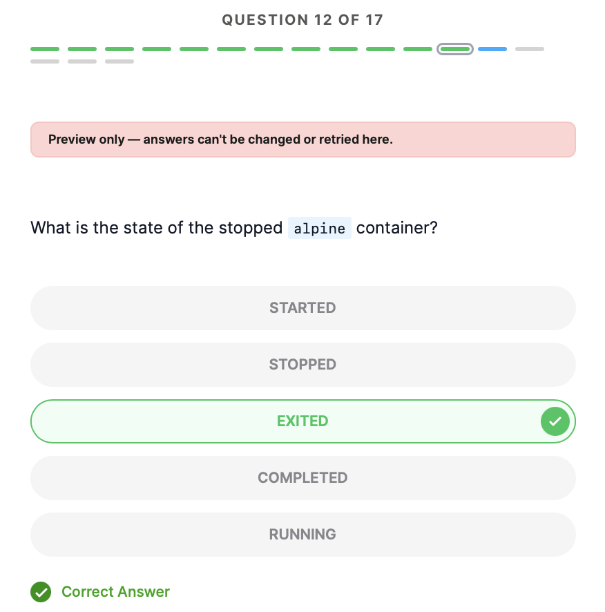
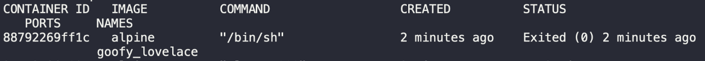

**Command Used:**
```bash
docker ps -a
```

**Relevant Output:**
```
88792269ff1c   alpine   "/bin/sh"   Exited (0) 2 minutes ago
```

**Answer:** `EXITED`

**Explanation:**  
When a container stops (either naturally or via `docker stop`), its state is shown as **Exited** in Docker — not "stopped" or "completed".

---

## Question 13 — Delete all containers from the Docker Host (both Running and Not Running)

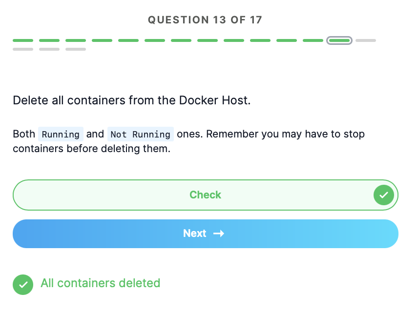
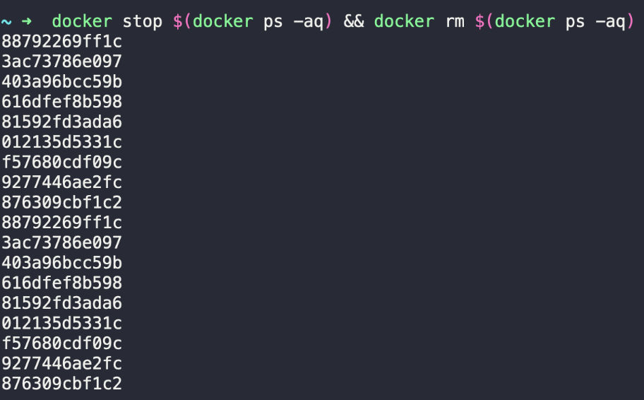

**Command Used:**
```bash
docker stop $(docker ps -aq) && docker rm $(docker ps -aq)
```

**Output:**  
All 9 container IDs were listed twice — once for stop, once for remove.

**Result:** ✅ All containers deleted

**Explanation:**  
- `docker ps -aq` returns all container IDs (quiet mode)
- `docker stop $(...)` stops all running containers
- `docker rm $(...)` removes all containers
- `&&` ensures remove only runs after stop succeeds

---

## Question 14 — Delete the `ubuntu` Image

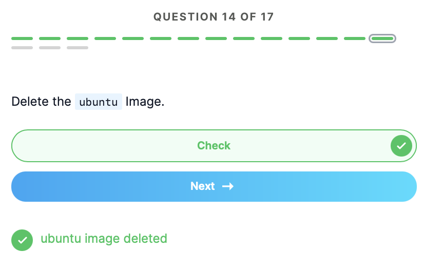
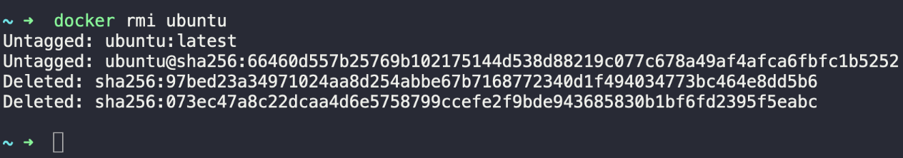

**Command Used:**
```bash
docker rmi ubuntu
```

**Output:**
```
Untagged: ubuntu:latest
Untagged: ubuntu@sha256:66460d557b25769b102175144d538d88219c077c678a49af4afca6fbfc1b5252
Deleted: sha256:97bed23a34971024aa8d254abbe67b71687723...
Deleted: sha256:073ec47a8c22dcaa4d6e5758799ccefe2f9bde...
```

**Result:** ✅ ubuntu image deleted

**Explanation:**  
`docker rmi` removes a Docker image. Docker untags the image first, then deletes its layers. The ubuntu image and all its associated layers were successfully removed.

---

## Question 15 — Pull the image `nginx:1.14-alpine` (without running a container)

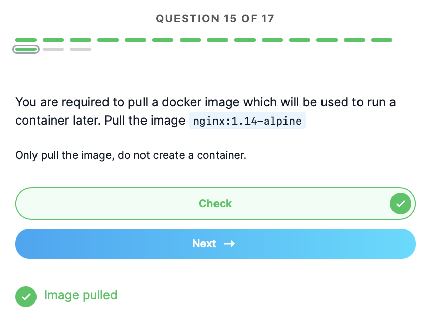
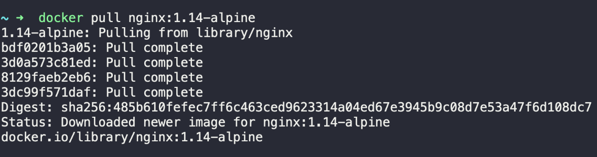

**Command Used:**
```bash
docker pull nginx:1.14-alpine
```

**Output:**
```
1.14-alpine: Pulling from library/nginx
bdf0201b3a05: Pull complete
3d0a573c81ed: Pull complete
8129faeb2eb6: Pull complete
3dc99f571daf: Pull complete
Status: Downloaded newer image for nginx:1.14-alpine
docker.io/library/nginx:1.14-alpine
```

**Result:** ✅ Image pulled

**Explanation:**  
`docker pull` downloads an image without creating a container. The tag `1.14-alpine` specifies the exact version — alpine means it's based on the lightweight Alpine Linux base image.

---

## Question 16 — Run a container using `nginx:1.14-alpine` and name it `webapp`

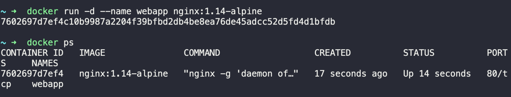


**Command Used:**
```bash
docker run -d --name webapp nginx:1.14-alpine
```

**Output:**
```
7602697d7ef4c10b9987a2204f39bfbd2db4be8ea76de45adcc52d5fd4d1bfdb
```

**Verified with:**
```bash
docker ps
```
```
CONTAINER ID   IMAGE              COMMAND                  STATUS          NAMES
7602697d7ef4   nginx:1.14-alpine  "nginx -g 'daemon of…"  Up 14 seconds   webapp
```

**Result:** ✅ Container created | ✅ Name: webapp

**Explanation:**  
`--name webapp` assigns a custom name to the container instead of a random auto-generated one. The container ran successfully on port 80/tcp.

---

## Question 17 — Cleanup: Delete all images on the host

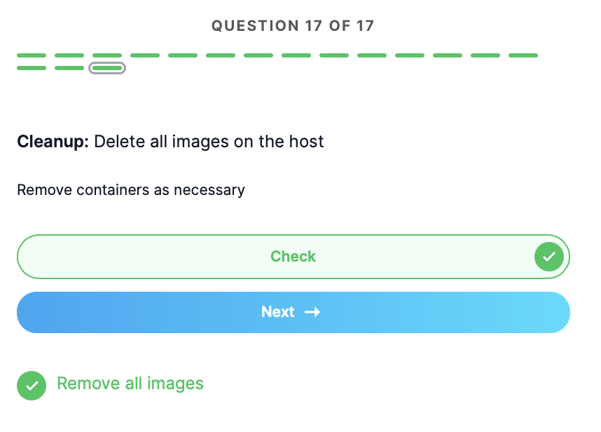
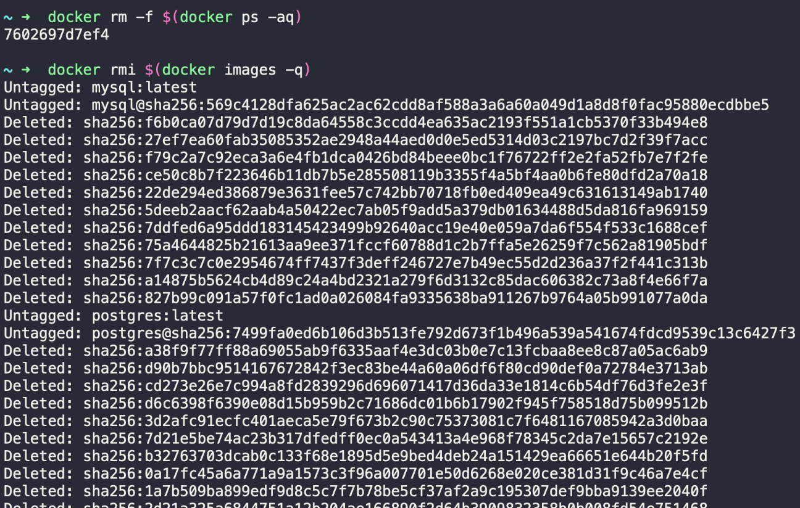

**Commands Used:**
```bash
# Step 1: Force remove all containers
docker rm -f $(docker ps -aq)

# Step 2: Remove all images
docker rmi $(docker images -q)
```

**Output:**  
All image layers were untagged and deleted — mysql, postgres, alpine, nginx, redis, kodekloud/simple-webapp-mysql, kodekloud/simple-webapp, and nginx:1.14-alpine.

**Result:** ✅ All images removed

**Explanation:**  
- `docker images -q` returns all image IDs
- `docker rmi $(...)` removes all images by ID
- All image layers (sha256 hashes) were deleted from the host

---

## Conclusion
The laboratory has given you firsthand knowledge on how to perform basic operations using the essential commands in Docker. From a total of 17 activities, the following essential skills have been acquired:

Checking the version and details about Docker
Handling containers by starting, stopping, and removing them
Manipulating Docker images through listing, pulling, and removing them
Using options such as -d, --name, -a, and -q

Through the lab exercises, a firm foundation for understanding the basics of Docker has been set, which will serve as the basis for further discussion on other related concepts such as networking, volumes, Docker Compose, and Kubernetes.