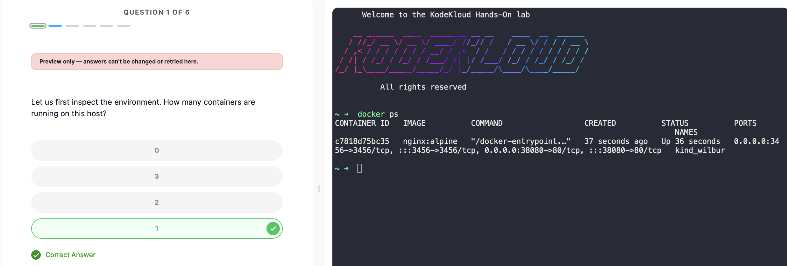
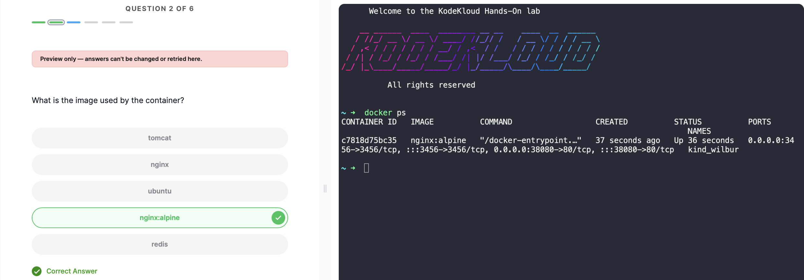
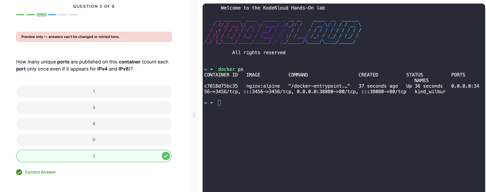
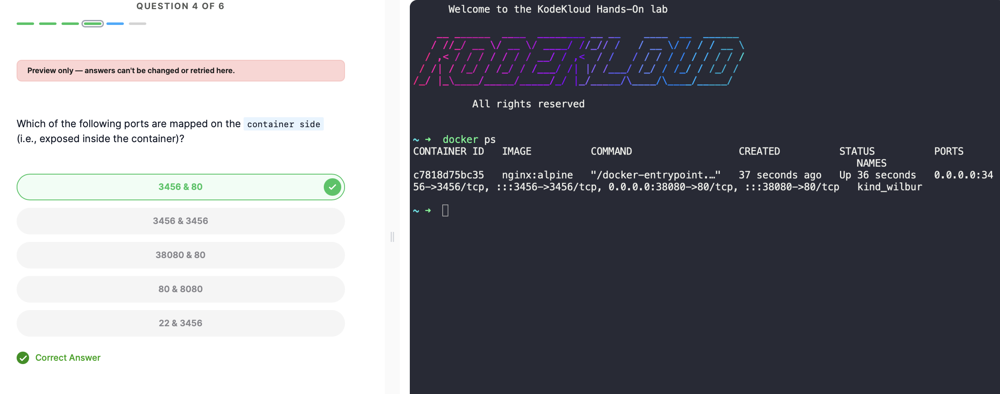
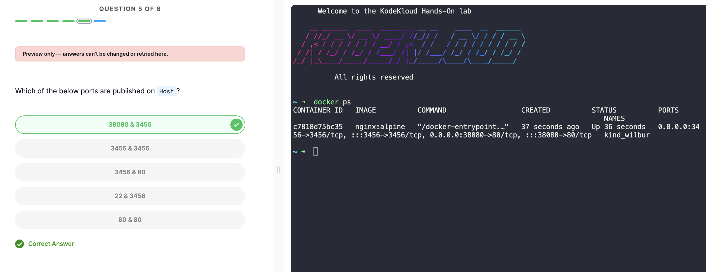
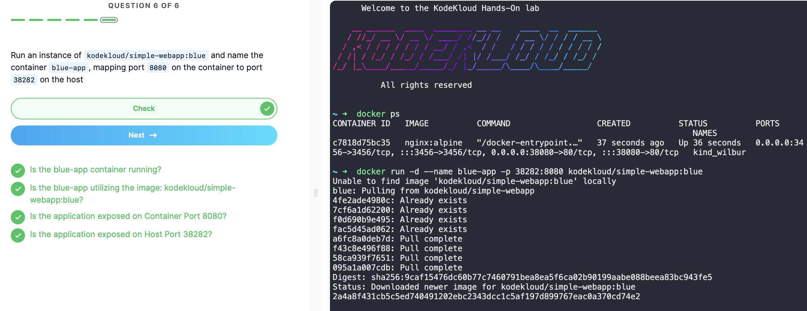

# Docker Lab Practical Report
**Platform:** KodeKloud  
**Topic:** Docker Container Inspection & Port Mapping
**Total Questions:** 6  

---

## Table of Contents

- [Question 1 — Running Containers](#question-1--running-containers)
- [Question 2 — Container Image](#question-2--container-image)
- [Question 3 — Published Ports](#question-3--published-ports)
- [Question 4 — Container Side Ports](#question-4--container-side-ports)
- [Question 5 — Host Side Ports](#question-5--host-side-ports)
- [Question 6 — Run a New Container](#question-6--run-a-new-container)
- [Conclusion](#conclusion)

---

## Question 1 — Running Containers

**Q: How many containers are running on this host?**

**Answer: `1`** 

### Command Used
```bash
docker ps
```

### Output


### Explanation
`docker ps` lists all **currently running** containers. Only one container (`kind_wilbur`) appeared in the output, so the answer is **1**.

---

## Question 2 — Container Image

**Q: What is the image used by the container?**

**Answer: `nginx:alpine`**

### Output


### Explanation
From the `docker ps` output, the **IMAGE** column shows `nginx:alpine`. This means the container is running an Nginx web server built on the lightweight Alpine Linux base image.

---

## Question 3 — Published Ports

**Q: How many unique ports are published on this container (count each port only once even if it appears for IPv4 and IPv6)?**

**Answer: `2`** 

### Output


### Explanation
Looking at the PORTS column in `docker ps`:

```
0.0.0.0:3456->3456/tcp, :::3456->3456/tcp, 0.0.0.0:38080->80/tcp, :::38080->80/tcp
```

| Host Port | Container Port | IPv4 | IPv6 |
|-----------|---------------|------|------|
| 3456 | 3456 | ✅ | ✅ |
| 38080 | 80 | ✅ | ✅ |

Both `3456` and `38080` appear twice (once for IPv4 `0.0.0.0` and once for IPv6 `:::`), but they count as **2 unique ports**.

---

## Question 4 — Container Side Ports

**Q: Which of the following ports are mapped on the container side (i.e., exposed inside the container)?**

**Answer: `3456 & 80`** 

### Output


### Explanation
In Docker's port notation `HOST_PORT->CONTAINER_PORT`, the number **after** the `->` arrow is the container-side port:

```
0.0.0.0:3456  ->  3456/tcp    ← container port: 3456
0.0.0.0:38080 ->  80/tcp      ← container port: 80
```

So inside the container, ports **3456** and **80** are exposed.

---

## Question 5 — Host Side Ports

**Q: Which of the below ports are published on the Host?**

**Answer: `38080 & 3456`** 

### Output


### Explanation
In Docker's port notation `HOST_PORT->CONTAINER_PORT`, the number **before** the `->` arrow is the host-side port:

```
0.0.0.0:3456  ->  3456/tcp    ← host port: 3456
0.0.0.0:38080 ->  80/tcp      ← host port: 38080
```

So on the host machine, ports **38080** and **3456** are listening.

---

## Question 6 — Run a New Container

**Q: Run an instance of `kodekloud/simple-webapp:blue` and name the container `blue-app`, mapping port `8080` on the container to port `38282` on the host.**

**Answer: Completed successfully** 

### Command Used
```bash
docker run -d --name blue-app -p 38282:8080 kodekloud/simple-webapp:blue
```

### Output


### Flag Analysis

| Flag              | Functionality                                      |
|-------------------|---------------------------------------------------|
| `-d`             | Detached mode                                     |
| `--name blue-app` | Name the container as `blue-app`                 |
| `-p 38282:8080`  | Expose application at Host Port `38282`, Container Port `8080`|
| `kodekloud/simple-webapp:blue` | Image to be executed in the container|

### Passed Verification Checks
- Running `blue-app` container?
- Is `blue-app` using image: `kodekloud/simple-webapp:blue`?
- Is the application exposed at Container Port `8080`?
- Is the application exposed at Host Port `38282`?

---

## Conclusion

This hands-on lab offered a practical approach in understanding the basic concepts of Docker involving **inspecting containers and port mapping**.

Using the `docker ps` command, it was possible to inspect the existing Docker containers as well as get their metadata such as the name of the image, the container itself, status, and ports. Another lesson gained from this exercise was the understanding of the syntax used in Docker for port specification. Specifically, the `HOST_PORT->CONTAINER_PORT` was crucial in distinguishing what ports were mapped inside the container and what ports were mapped to the outside world.

Lastly, the last question of this lab involved using a `docker run` command that required the appropriate flag such as the `-d` (for detach mode), `--name` to specify the name of the container and `-p` for port mapping. Additionally, Docker downloaded the needed image from its hub automatically in case it was not available in the local environment.

Thus, one learns that even the simplest running Docker container may have several ports mapped on both IPv4 and IPv6 interfaces.